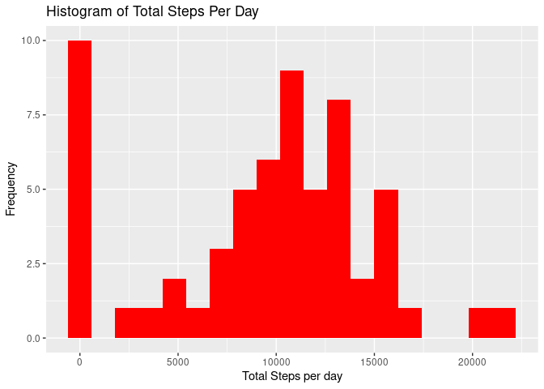
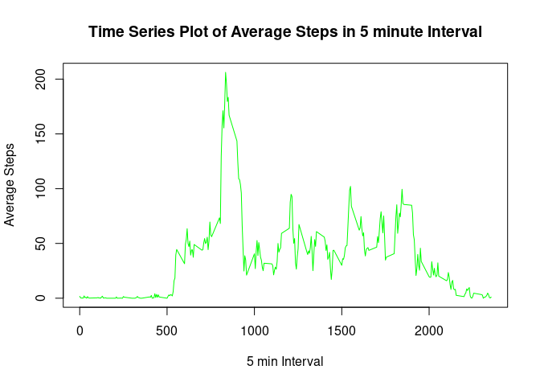
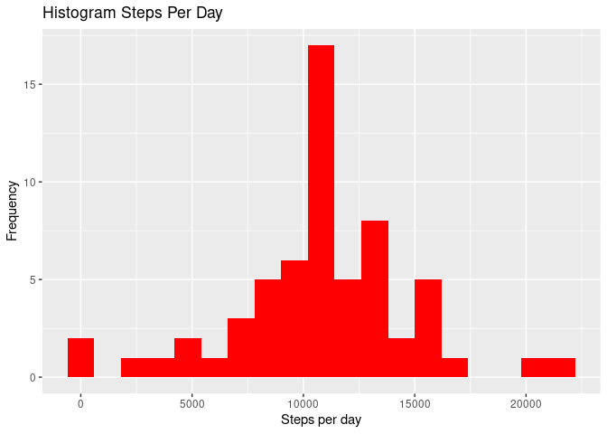
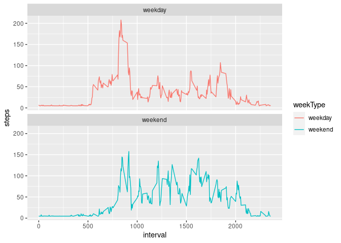

This assignment makes use of data from a personal activity monitoring device. This device collects data at 5 minute intervals through out the day. The data consists of two months of data from an anonymous individual collected during the months of October and November, 2012 and include the number of steps taken in 5 minute intervals each day.


## Loading and preprocessing the data


The variables included in this dataset are:
1. Number of steps taking in a 5-minute interval (missing values are coded as NA)
2. The date on which the measurement was taken in YYYY-MM-DD format
3. Identifier for the 5-minute interval in which measurement was taken

The dataset is stored in a comma-separated-value (CSV) file and there are a total of 17,568 observations in this dataset.


```r
activity <- read.csv("activity.csv")
activity$date<-as.Date(as.character(activity$date),format="%Y-%m-%d")
str(activity)
```

```
## 'data.frame':	17568 obs. of  3 variables:
##  $ steps   : int  NA NA NA NA NA NA NA NA NA NA ...
##  $ date    : Date, format: "2012-10-01" "2012-10-01" ...
##  $ interval: int  0 5 10 15 20 25 30 35 40 45 ...
```

Here is the summary of activity data set.


```r
summary(activity)
```

```
##      steps             date               interval     
##  Min.   :  0.00   Min.   :2012-10-01   Min.   :   0.0  
##  1st Qu.:  0.00   1st Qu.:2012-10-16   1st Qu.: 588.8  
##  Median :  0.00   Median :2012-10-31   Median :1177.5  
##  Mean   : 37.38   Mean   :2012-10-31   Mean   :1177.5  
##  3rd Qu.: 12.00   3rd Qu.:2012-11-15   3rd Qu.:1766.2  
##  Max.   :806.00   Max.   :2012-11-30   Max.   :2355.0  
##  NA's   :2304
```

## What is mean total number of steps taken per day?

Here we calculate the total number of steps taken per day and store the data in
dataframe tot_steps_eachday.


```r
tot_steps_eachday<-activity%>%
  group_by(date) %>%
  summarise(tot_step=sum(steps,na.rm=TRUE))
```

In the histogram plot of the total number of steps taken each day shows highest 
frequency at 0 steps.
  

```r
ggplot(tot_steps_eachday, aes(tot_step)) +
  geom_histogram(fill = "red", binwidth = 1200) +
  labs(title = "Histogram of Total Steps Per Day", x = "Total Steps per day", y = "Frequency")
```

<!-- -->

Mean is smaller than median of the total number of steps taken per day.


```r
mean(tot_steps_eachday$tot_step,na.rm=TRUE)
```

```
## [1] 9354.23
```

```r
median(tot_steps_eachday$tot_step,na.rm=TRUE)
```

```
## [1] 10395
```

## What is the average daily activity pattern?

To make a time series plot (i.e. type = "l") of the 5-minute interval (x-axis) and the average number of steps taken, averaged across all days (y-axis) we calculate
average number of steps and store in a data frame avg_steps.


```r
avg_steps<-activity%>%
  group_by(interval) %>%
  summarize(avg_step=mean(steps,na.rm=TRUE))
```

Here we show time series plot of average steps in 5 minute interval.


```r
plot(avg_steps,type="l",col="green",xlab="5 min Interval",ylab="Average Steps",main="Time Series Plot of Average Steps in 5 minute Interval")
```

<!-- -->

To show which 5-minute interval, on average across all the days in the dataset, contains the maximum number of steps we use which.max function.
 

```r
avg_steps[which.max(avg_steps$avg_step),]
```

```
## # A tibble: 1 × 2
##   interval avg_step
##      <int>    <dbl>
## 1      835     206.
```

## Imputing missing values

Note that there are a number of days/intervals where there are missing values (coded as NA). The presence of missing days may introduce bias into some calculations or summaries of the data.

We calculate and report the total number of missing values in the dataset (i.e. the total number of rows with NAs)


```r
sum(is.na(activity$steps))
```

```
## [1] 2304
```

For filling in all of the missing values in the dataset we use the mean steps for that 5-minute interval. 


We create a new dataset named activity_impute that is equal to the original dataset but with the missing data filled in.


```r
activity_impute<-data.frame(impute(activity$steps, mean),activity$date,activity$interval)
names(activity_impute)<-c("steps","date","interval")
activity_impute$steps<-as.numeric(activity_impute$steps)
str(activity_impute)
```

```
## 'data.frame':	17568 obs. of  3 variables:
##  $ steps   : num  37.4 37.4 37.4 37.4 37.4 ...
##  $ date    : Date, format: "2012-10-01" "2012-10-01" ...
##  $ interval: int  0 5 10 15 20 25 30 35 40 45 ...
```

Using imputed data set we calculated total number of steps taken par day. 


```r
tot_steps_eachday_impute<-activity_impute%>%
  group_by(date) %>%
  summarise(tot_step=sum(steps))
```

 We create a histogram plot of the total number of steps taken each day and
 now the highest point shifted from 0 to 10000.
 

```r
ggplot(tot_steps_eachday_impute, aes(tot_step)) +
  geom_histogram(fill = "red", binwidth = 1200) +
  labs(title = "Histogram Steps Per Day", x = "Steps per day", y = "Frequency")
```

<!-- -->

Now mean and median value changed.


```r
mean(tot_steps_eachday_impute$tot_step)
```

```
## [1] 10766.19
```

```r
median(tot_steps_eachday_impute$tot_step)
```

```
## [1] 10766.19
```


## Are there differences in activity patterns between weekdays and weekends?

Next we create a new factor variable in the dataset with two levels – “weekday” and “weekend” indicating whether a given date is a weekday or weekend day.


```r
activity_impute$weekType <-  ifelse(as.POSIXlt(activity_impute$date)$wday %in% c(0,6), 'weekend', 'weekday')
activity_wday <- activity_impute %>%
  group_by(interval, weekType) %>%
  summarise(steps = mean(steps))
```

```
## `summarise()` has grouped output by 'interval'. You can override using the
## `.groups` argument.
```

We make a panel plot containing a time series plot (i.e. type = "l") of the 5-minute interval (x-axis) and the average number of steps taken, averaged across all weekday days or weekend days (y-axis). 


```r
ggplot(activity_wday, aes(interval, steps, color = weekType)) +
  geom_line() +
  facet_wrap(~ weekType, ncol = 1) 
```

<!-- -->
